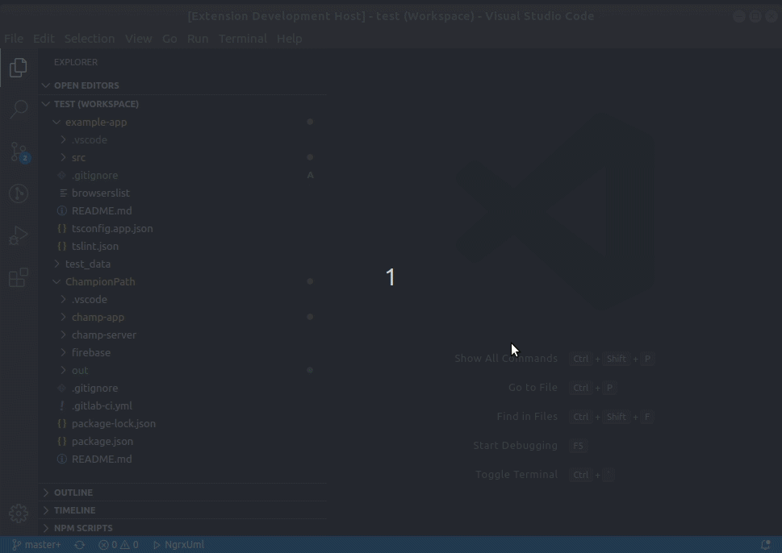
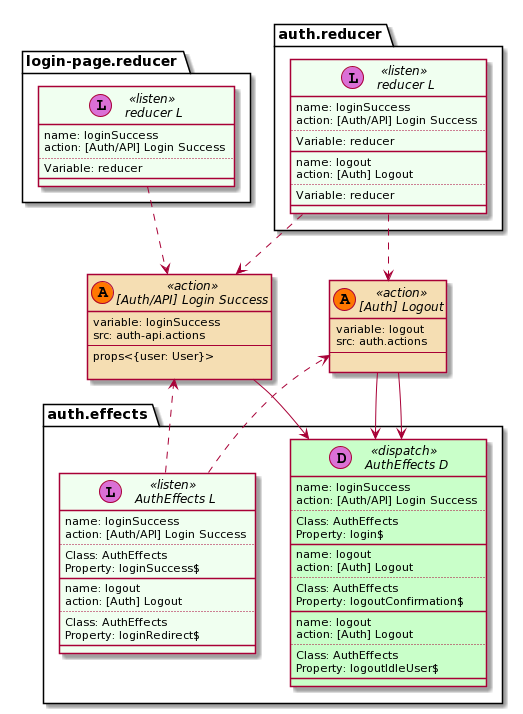

# ngrx-uml

## Features

Generate Plant UML diagram from [ngrx/store](https://ngrx.io) project (version >= 7.0).

Generate separete diagram for each [Action](https://ngrx.io/guide/store/actions) or/and [Reducer/State](https://ngrx.io/guide/store/reducers).

Searches for:
- actions created function [createAction](https://ngrx.io/api/store/createAction) and their use
- reducers created function  [createReducer](https://ngrx.io/api/store/createReducer)

## Commands

### `NgrxUml.Diagram` command

## Requirements

Used [ngrx-uml](https://www.npmjs.com/package/ngrx-uml) package.

## Extension Settings

This extension contributes the following settings:

|Name|Description|Default|
|----|-------|-----|
| `ngrxUml.input.workspaceFolder` |   Default workspace folder |
| `ngrxUml.input.includeFiles` |  Glob-like file pattern specifying the filepath for the source files. Relative to baseDir | "**/*.ts" |
| `ngrxUml.input.ignoreFiles` |  Glob-like file pattern specifying files to ignore | [ "**/*.spec.ts", "**/node_modules/**"] |
| `ngrxUml.input.tsConfigFile` |  tsconfig.json file name with relative path from baseDir | "tsconfig.json" |
| `ngrxUml.output.generateDiagramImages` |  Generate Diagram images | false |
| `ngrxUml.output.imageFormat` |  Generate diagrams in specified format  [  "eps","latex","png","svg","txt"] | "png" |
| `ngrxUml.output.outDir` |   Redirect output structure to the directory | "out"	 |
| `ngrxUml.output.generateJsonFiles` |   Generate intermediate files to json | true |
| `ngrxUml.output.generateWsdFiles` |  Generate plant uml file (.wsd) | true |
| `ngrxUml.general.clickableLinks` |   Convert terminal links to clickable in vs code terminal | true |
| `ngrxUml.general.logLevel` |  Log level | "INFO" |
| `ngrxUml.general.showStatusBar` |   Show status bar item | true |

## Examples

Generated from source code [ngrx/store example app](https://github.com/ngrx/platform/tree/master/projects/example-app) 

### Action diagram (png)

### Auth Reducer diagram (png)

### Action diagram (wsd) 

[Plantuml file](docs/assets/examples/_Auth-API_Login-Success.wsd)

## Known Issues

Please post and view issues on [GitHub](https://github.com/immament/vscode-ngrx-uml/issues)