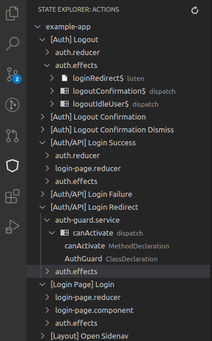
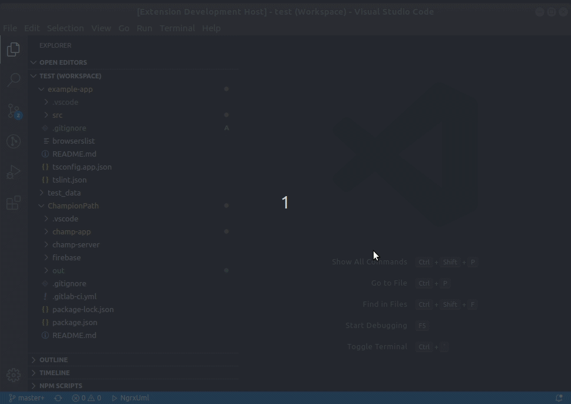
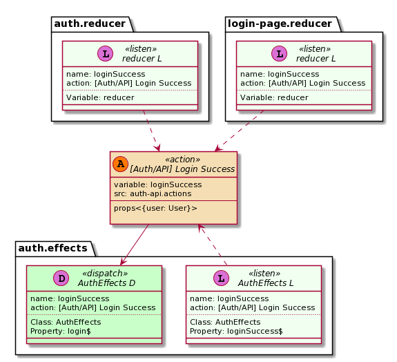

# Ngrx Uml

## Features

### Generate diagrams
Generate Plant UML diagram from [ngrx/store](https://ngrx.io) project (version >= 7.0).

Generate separete diagram for each [Action](https://ngrx.io/guide/store/actions) or/and [Reducer/State](https://ngrx.io/guide/store/reducers).

Searches for:
- actions created function [createAction](https://ngrx.io/api/store/createAction) and their use
- reducers created function  [createReducer](https://ngrx.io/api/store/createReducer)

### Action tree view

Show actions and references in tree view. Workspace folder have to contains generated data in json format (default directory: 'out'). Folder can be change in extension settings.

## Commands

### `NgrxUml.Diagram` command

### Other commands 
* `ngrx-uml.refreshTreeView` - refresh state tree view

## Requirements

Used [ngrx-uml](https://www.npmjs.com/package/ngrx-uml) package.

## Extension Settings

This extension contributes the following settings:
* `ngrxUml.input.workspaceFolder` - Default workspace folder
* `ngrxUml.input.includeFiles` - Glob-like file pattern specifying the filepath for the source files. Relative to baseDir - default:  "**/*.ts"
* `ngrxUml.input.ignoreFiles` - Glob-like file pattern specifying files to ignore - default:  [ "**/*.spec.ts", "**/node_modules/**"]
* `ngrxUml.input.tsConfigFile` - tsconfig.json file name with relative path from baseDir - default:  "tsconfig.json"
* `ngrxUml.output.generateDiagramImages` - Generate Diagram images - default:  false
* `ngrxUml.output.imageFormat` - Generate diagrams in specified format  [  "eps","latex","png","svg","txt"] - default:  "png"
* `ngrxUml.output.outDir` -  Redirect output structure to the directory - default:  "out"
* `ngrxUml.output.generateJsonFiles` - Generate intermediate files to json. It must be enabled for state tree view to work - default: true
* `ngrxUml.output.generateWsdFiles` - Generate plant uml file (.wsd) - default:  true
* `ngrxUml.general.clickableLinks` -  Convert terminal links to clickable in vs code terminal - default:  true
* `ngrxUml.general.logLevel` - Log level - default:  "INFO"
* `ngrxUml.general.showStatusBar` -  Show status bar item - default: true

## Examples

Generated from source code [ngrx/store example app](https://github.com/ngrx/platform/tree/master/projects/example-app) 

### Action diagram (png)

### Auth Reducer diagram (png)

### Action diagram (wsd) 

[Plantuml file](assets/examples/_Auth-API_Login-Success.wsd)

## Known Issues

Please post and view issues on [GitHub](https://github.com/immament/vscode-ngrx-uml/issues)